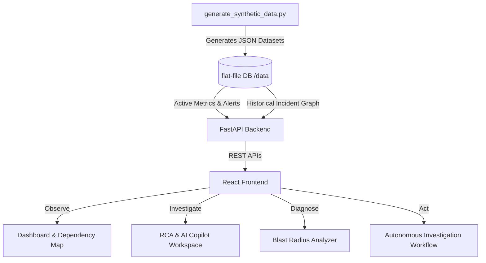
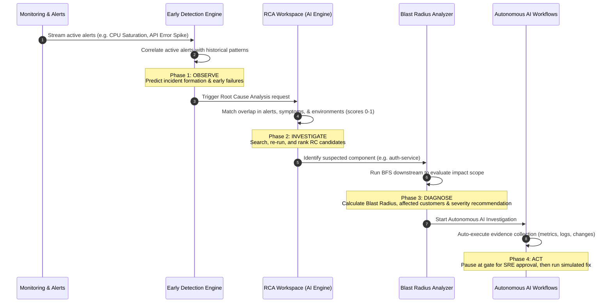

# Autonomous IT Operations Intelligence Platform: System Architecture & Operational Flow

This document details the system design, the 7-layer incident knowledge graph model, how the synthetic data is structured, and the step-by-step **Observe → Investigate → Diagnose → Act** workflow.

---

## 1. Core Architecture Overview

The platform is designed to transition IT Operations, Site Reliability Engineering (SRE), and Network Operations Center (NOC) teams from reactive manual fire-fighting to AI-assisted, autonomous operations.



### The Data Layer
The system uses flat JSON files generated by [generate_synthetic_data.py](file:///c:/Users/lenovo/autonomous-observability/scripts/generate_synthetic_data.py) to simulate a complete datacenter. 
- **500 historical incidents** with root cause records, timeline data, and fix playbooks.
- **Topological dependencies** between 6 business services, 12 applications, 15 microservices, load balancers, database clusters, messaging queues, Kubernetes nodes, and physical server racks.
- **Active telemetry streams** (CPU, memory, latency, throughput, disk I/O, error rates) and active alert logs.

---

## 2. The 7-Layer Knowledge Graph Model

Every incident in the platform is parsed into a standardized **7-Layer Graph Construct** to allow cross-correlation and root cause discovery.

| Layer | Construct Name | Description | Example |
| :--- | :--- | :--- | :--- |
| **1** | **Alert** | Triggered metric anomaly on an infrastructure or platform node. | `CPU Saturation`, `Connection Pool Exhaustion` |
| **2** | **Symptom** | User-visible or app-level indicator of the problem. | `Latency Increase`, `Timeout Errors` |
| **3** | **Incident** | The service ticket record representing the event. | `INC-1023` |
| **4** | **Root Cause** | The identified source of failure. | `DB Index Regression`, `Kafka Consumer Lag` |
| **5** | **Fix** | Actionable playbook task that resolves the incident. | `Add database index`, `Purge queue backlog` |
| **6** | **Impacted Components** | Software or hardware nodes degraded by the failure. | `auth-service`, `postgres-cluster` |
| **7** | **Context** | Environment metadata (environment, region, teams, dates). | `production / us-east / SRE Team` |

### Relationship Edges in the Graph:
- `TRIGGERS` (e.g., Alert → Symptom)
- `ASSOCIATED_WITH` (e.g., Symptom → Incident)
- `CAUSED_BY` (e.g., Incident → Root Cause)
- `RESOLVED_BY` (e.g., Root Cause → Fix)
- `IMPACTED` (e.g., Incident → Impacted Component)
- `PRECEDES` (e.g., Change Record/Deployment → Incident)
- `DEPENDS_ON` (e.g., Service → Microservice → Database)

---

## 3. The 4-Phase Operational Flow (Step-by-Step)

The platform enables SREs to follow a complete **Observe → Investigate → Diagnose → Act** lifecycle.



---

### Phase 1: Observe (Early Failure Detection & Monitoring)
- **Active Monitoring**: The dashboard displays live metrics. When a metric breaches a threshold (e.g., `postgres-cluster` latency > 200ms), it triggers an alert.
- **Pattern Matching**: The [Early Failure Detection Engine](file:///c:/Users/lenovo/autonomous-observability/backend/app/services/intelligence.py#L321) scans currently active alerts and runs them against a historical `pattern_library`. 
  - **Sample Logic**: If `CPU Saturation` and `API Error Spike` are active on `payment-authorization`, the engine calculates a **91% probability** that a `DB Index Regression` incident is forming. It provides an estimated Time-to-Incident (e.g., 8 minutes) and generates proactive recommendations.

---

### Phase 2: Investigate (RCA & AI Copilot Workspace)
- **Global Search**: SREs search using terms like `"database connection timeout"` or incident numbers like `INC-1023`.
- **RCA Algorithm**: SREs run an interactive RCA check by submitting a list of active alerts and symptoms:
  ```json
  {
    "alerts": ["CPU Saturation", "API Error Spike"],
    "symptoms": ["Latency Increase", "Retry Storm"],
    "service": "payment-authorization"
  }
  ```
  - The backend matches these inputs against historical ServiceNow records:
    - Overlap of alerts: `45% weight`
    - Overlap of symptoms: `35% weight`
    - Match of business services: `20% weight`
  - It outputs ranked candidates with confidence scores:
    1. **DB Index Regression** (Confidence: 95%) — Suggested Fix: *Add database index*
    2. **Connection Pool Exhaustion** (Confidence: 70%) — Suggested Fix: *Increase connection pool*
- **AI Copilot**: SREs ask the assistant questions like *"Why was this identified as the root cause?"*. The backend parses the query, queries the knowledge graph, and provides evidence-based responses linked directly to source files.

---

### Phase 3: Diagnose (Blast Radius Analyzer)
Once a root cause candidate is identified, the platform estimates the impact scope:
- **BFS Downstream & Upstream Mapping**: Using the dependency graph, the engine starts at the suspected component (e.g. `auth-service`) and traverses dependencies:
  - Downstream: `auth-service` → `payment-authorization` → `api-gateway-services`
  - Upstream: `postgres-cluster` → `storage-cluster-1`
- **Impact Assessment**: It calculates:
  - **Scope**: *Systemic* (if it cascades across multiple critical nodes) vs. *Localized*.
  - **Affected Customer Estimate**: Based on business service weight (e.g., `payment-authorization` is high impact, affecting ~4,750 customers).
  - **Recommended Severity**: Suggests a P1 (Critical) or P2 (High) severity ticket.

---

### Phase 4: Act (Autonomous Investigation & Remediation)
- **Workflow Automation**: SREs initiate an Autonomous Investigation. The platform spawns a state-machine that advances through 14 logical steps:
  1. `issue_detected` ➔ `collect_metrics` ➔ `collect_alerts` ➔ `review_logs` ➔ `review_change_history` ➔ `build_dependency_path` ➔ `query_rca_graph` ➔ `predict_blast_radius` ➔ `recommend_fix`.
- **Human-in-the-Loop Gate**: The workflow reaches `awaiting_human_approval`. It displays the recommended fix (*"Add database index"*).
- **Execution**: Upon clicking **Approve & Execute**, the system runs a simulated remediation script, updates the ticket status to `completed`, and returns the system health to Green.

---

## 4. Sample JSON Data Payloads

Here are examples of how the files in `/data` represent an incident and its connections.

### Incident Record (`data/incidents/service_now_incidents.json`)
```json
{
  "incident_id": "INC-1000",
  "title": "Payment Authorization degradation - DB Index Regression",
  "severity": "P1",
  "service": "Payment Authorization",
  "service_id": "payment-authorization",
  "alerts": [
    "CPU Saturation",
    "API Error Spike"
  ],
  "symptoms": [
    "Latency Increase",
    "Retry Storm"
  ],
  "root_cause": "DB Index Regression",
  "fix": "Add database index",
  "impacted_components": [
    "auth-service",
    "postgres-cluster",
    "api-gateway"
  ],
  "owner_team": "SRE Team",
  "start_time": "2026-03-15T08:12:00.000Z",
  "end_time": "2026-03-15T09:42:00.000Z",
  "duration_minutes": 90.0,
  "confidence_training_value": 0.95,
  "resolution_notes": "Identified DB Index Regression affecting Payment Authorization. Applied fix: Add database index. Validated recovery via synthetic monitoring."
}
```

### Knowledge Graph Node (`data/rca/knowledge_graph.json`)
```json
{
  "nodes": [
    { "id": "alert-cpu-saturation", "type": "alert", "label": "CPU Saturation" },
    { "id": "symptom-latency-increase", "type": "symptom", "label": "Latency Increase" },
    { "id": "incident-INC-1000", "type": "incident", "label": "INC-1000", "severity": "P1" },
    { "id": "rc-db-index-regression", "type": "root_cause", "label": "DB Index Regression" },
    { "id": "fix-add-database-index", "type": "fix", "label": "Add database index" }
  ],
  "edges": [
    {
      "source": "alert-cpu-saturation",
      "target": "symptom-latency-increase",
      "relationship": "TRIGGERS",
      "frequency": 42,
      "confidence": 0.95,
      "incident_refs": ["INC-1000", "INC-1010", "INC-1035"]
    },
    {
      "source": "incident-INC-1000",
      "target": "rc-db-index-regression",
      "relationship": "CAUSED_BY",
      "frequency": 1,
      "confidence": 0.99,
      "incident_refs": ["INC-1000"]
    }
  ]
}
```
